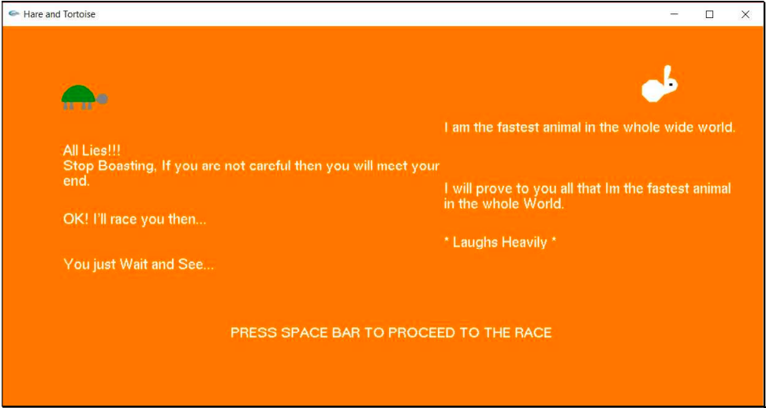
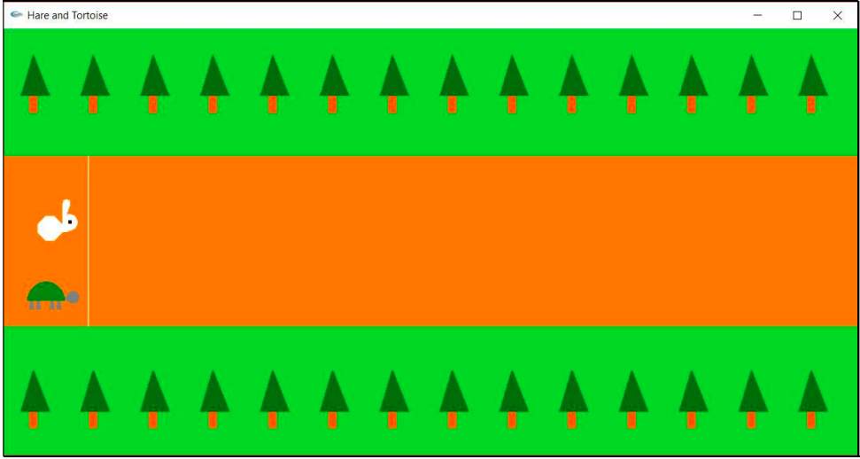
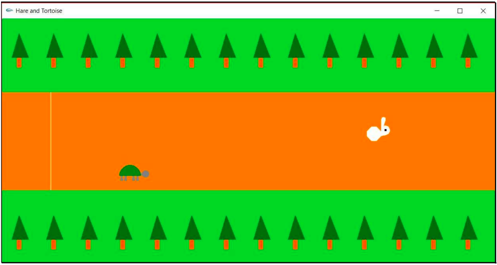
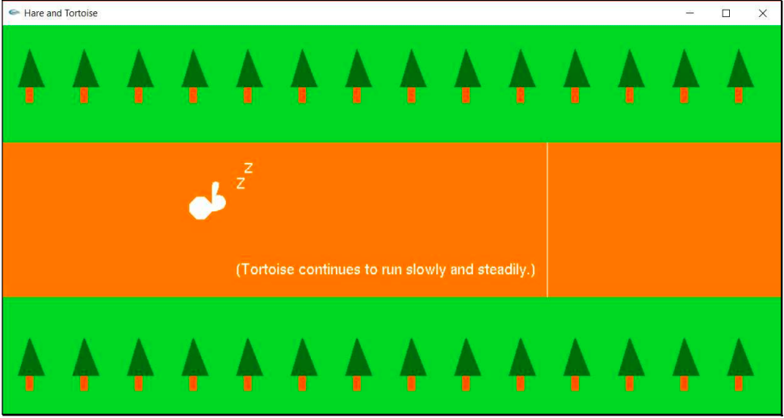
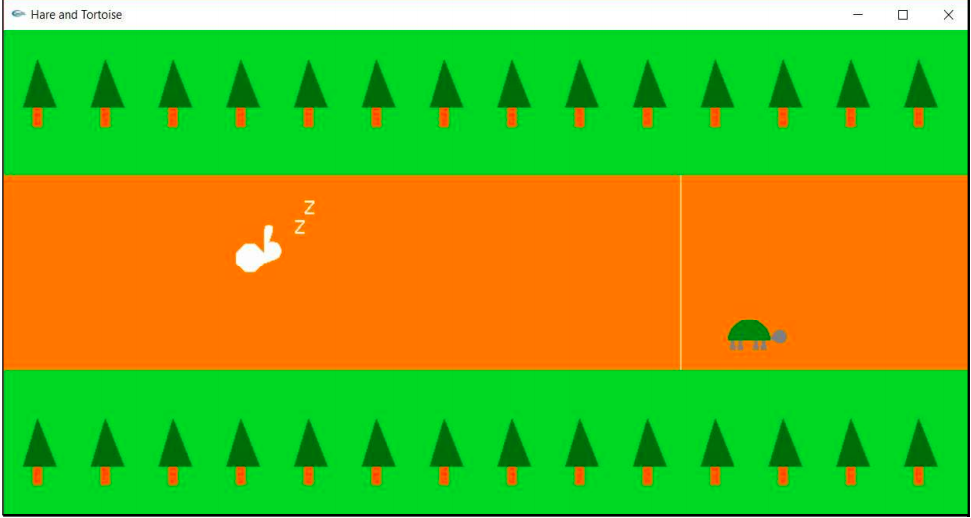
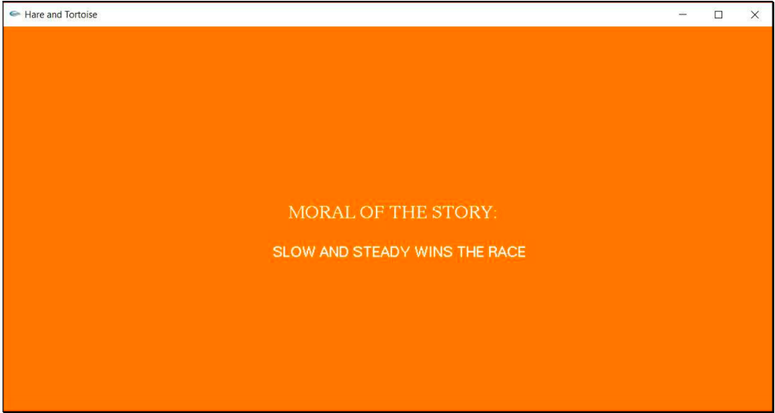

# Hare Tortoise Storyboard by OpenGL

We have tried to visualize the popular story of hare and tortoise with the help o OpenGL library in C++.

OpenGL library [Installsion note](http://www.cse.iitm.ac.in/~vplab/courses/CG/OpenGL-Install-Guide.pdf)

## Screenshots:

